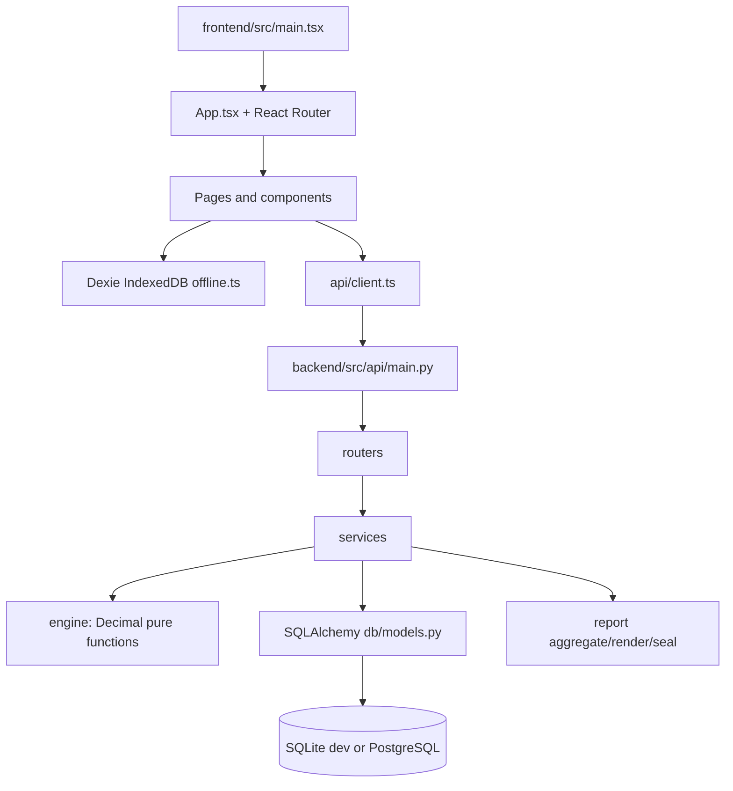
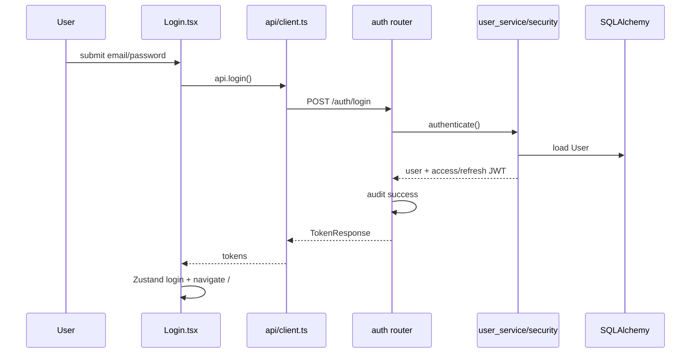
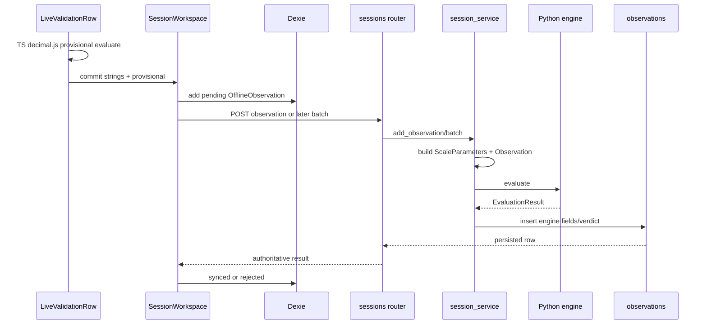
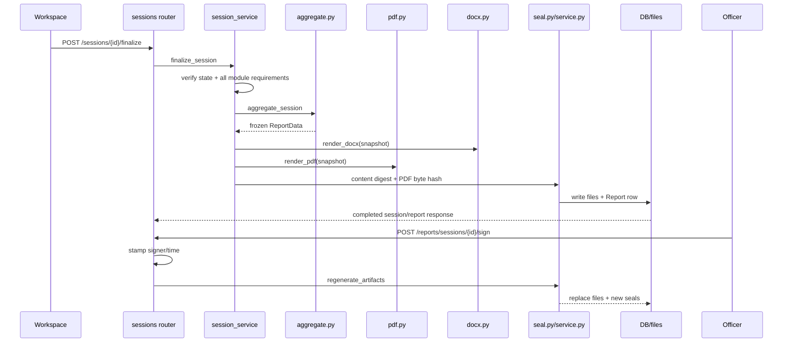

# Repository Reverse Engineering Manual

This is a code-first guide to the repository as it exists now. The architecture documents describe intent; this document follows the live files and names the places where implementation and plan differ.

## 1. Mental model

There are two runtimes:

The backend verdict is authoritative. The browser engine is a provisional mirror used for immediate offline feedback. A committed observation has this invariant:

`JSON strings -> Pydantic Decimal validation -> service adapter -> pure Python engine -> SQLAlchemy Observation row -> API response/report`.

The frontend path is:

`input/serial frame -> TS decimal.js mirror -> IndexedDB pending row -> batch sync -> backend re-evaluation -> synced/rejected local state`.

## 2. Startup and import order

### Backend

The deployment command is `uvicorn src.api.main:app`. Python imports `src.api.main`, which imports settings and the router modules. Importing router modules imports schemas, dependency functions, service functions, ORM models, and report helpers. The module then constructs `FastAPI`, installs CORS, registers six router objects, and exposes `GET /health`. No request is handled during import.

`database.py` creates the SQLAlchemy engine and `SessionLocal` at import time from `settings.database_url`; it does not create tables. `create_all()` is called by seed scripts/tests, not by `main.py`. Each request that declares `DbDep` receives a session from `get_db`, and the generator closes it after the request.

### Frontend

Vite serves `frontend/index.html`; the HTML `#root` element is the mount point. Vite loads `frontend/src/main.tsx`, which imports CSS and `App.tsx`, creates a React root, and renders `<StrictMode><App /></StrictMode>`. `App` starts the connectivity watcher and a 30-second outbox sync interval in `useEffect`, then creates the router. React Router lazy work is not used: page modules are imported up front.

The service worker is not the application entry point. `usePwaInstall` registers `/sw.js` after React mounts. The worker caches assets/navigation but deliberately does not intercept API traffic.

## 3. Backend file-by-file map

For each implementation file below: imports are the direct collaborators; inputs and outputs are the public data boundary; “remove” states the practical consequence.

### `backend/src/__init__.py`

Package marker. It is imported implicitly when `src.*` is resolved. It imports nothing, creates no objects, and exports no behavior. Removing it can change package discovery in older/tooling contexts.

### `backend/src/api/__init__.py`

API package marker. It is loaded when `src.api` or a relative router import is resolved. No runtime behavior; removal may break package-style imports.

### `backend/src/api/main.py`

Creates the FastAPI application object `app`, installs `CORSMiddleware`, and includes `auth`, `instruments`, `sessions`, `attachments`, and `reports` routers under `/api/v1`; it also includes the unauthenticated report verification router. It imports `settings` and router modules. `health()` is called by deployment health checks and returns a new `{"status": "ok"}` dictionary. Removing it removes the ASGI application and every HTTP route.

### `backend/src/api/schemas.py`

Defines HTTP DTOs. Pydantic parses request JSON and creates objects such as `LoginRequest`, `InstrumentCreate`, `SessionCreate`, `ObservationCreate`, and batch/report response models; `ConfigDict(from_attributes=True)` lets output models be constructed from ORM instances. Decimal aliases come from `engine.models`, so numeric strings become `Decimal` and floats are rejected before domain evaluation. Schemas leave the router as validated Python objects and become JSON on response. Removing a schema removes the HTTP contract and response validation, not the domain engine.

Important objects: `LoginRequest`, `TokenResponse`, `RefreshRequest`, `UserCreate`, `UserOut`; `InstrumentCreate/Out`, `InstrumentPage`; `SessionCreate/Patch/Out/Page`, `DriftReport`; `ObservationCreate/Out`, `BatchSyncRequest/Response`, `ObservationCreatedResponse`; report archive/verify DTOs. They contain no workflow logic.

### `backend/src/api/deps.py`

FastAPI dependency graph. `get_db` supplies a request session; `current_user` extracts a bearer token, calls `decode_token`, loads `User`, and rejects missing/invalid/deactivated identities. `require_roles(*allowed)` creates a closure `_guard`; `TechnicianOnly`, `TechnicianPlus`, `OfficerOnly`, `AdminOnly`, and `AnyUser` are typed dependency aliases. `token_pair_response` calls the security token creators and returns `TokenResponse`. Removing it leaves routes unable to obtain DB sessions or enforce authentication/RBAC.

### `backend/src/api/audit_helpers.py`

Thin router-to-audit adapter. `client_ip(request)` reads the first forwarded IP or the direct client address. `audit(...)` converts a `User` to actor fields, calls `audit_service.record`, then commits. It receives request/user/action/object/detail and returns nothing. It is called after successful writes and failed login paths. Removing it leaves business operations working but silently removes accountability unless every router reimplements the call.

### `backend/src/api/routers/auth.py`

Defines `router` (`/auth`) and `users_router` (`/users`). `login` passes credentials to `user_service.authenticate`, audits success/failure, and returns tokens. `refresh` validates a refresh token and returns a new pair. `create_new_user` is admin-only and calls `create_user`; `read_me` projects the current user; `read_audit_trail` calls `list_recent`; `verify_audit_chain` calls `verify_chain`. Objects are request DTOs in and response DTOs/dictionaries out. Removing this file removes authentication, user management, and audit inspection routes.

### `backend/src/api/routers/instruments.py`

`register_instrument` receives `InstrumentCreate`, calls `instrument_service.create_instrument`, translates `InstrumentValidationError` into HTTP 422, audits, and returns `InstrumentOut`. `search_instruments` calls paginated search for authenticated readers. `read_instrument` calls `get_instrument` and maps missing rows to 404. No math is performed here; the router only converts HTTP concerns.

### `backend/src/api/routers/sessions.py`

The main workflow router. It creates sessions, lists/reads them, patches environment, reads drift, lists observations, inserts one observation, accepts batch sync, finalizes, and signs indirectly through report logic. `_get_session_or_404` is the common lookup adapter. Create/patch/observation/finalize paths call `audit`. Observation routes translate `EngineValueError`, duplicate, and closed-session exceptions to HTTP errors. Finalize calls `session_service.finalize_session`, which calls report generation before returning. Removing it removes all evaluation lifecycle HTTP access.

### `backend/src/api/routers/reports.py`

Authenticated archive/download endpoints plus `public_router` verification. It loads `Report`, deliberately projects archive data without filesystem paths, streams PDF/DOCX bytes, and `public_verify` returns the stored byte seal, QR content digest, signer, session state, and `reverify_bytes` result without authentication. `sign_session` requires an officer/admin, stamps signer/time, calls `regenerate_artifacts`, commits, and audits. Removing it loses artifact access, public verification, and sign-off.

### `backend/src/api/routers/attachments.py`

`upload_attachment` checks session existence, MIME type, size, and non-empty content; creates a UUID filename under `settings.uploads_dir`, writes bytes, audits, and deletes the file if audit fails. `uploads_root` exposes the directory helper to tests/report code. Data entering is multipart file bytes; data leaving is metadata, never the file path in the public report projection. Removing it removes evidence capture.

### `backend/src/core/config.py`

Creates the settings object from environment variables (database URL, JWT secret, CORS, upload/report roots, allowed MIME types, size limits, temperature/drift limits, verification URL). It is imported by database, security, routers, services, and reports. The settings object is shared read-only configuration. Removing it forces every consumer to duplicate environment parsing and makes deployment configuration inconsistent.

### `backend/src/core/security.py`

Password/JWT boundary. It defines role constants and token type constants, hashes/verifies passwords with bcrypt, and creates/decodes access and refresh JWTs. `decode_token` validates signature, expiry, and expected token type. Authentication calls these functions; no ORM object is created here. Removing it makes login and all authenticated dependencies unusable.

### `backend/src/db/database.py`

Creates SQLAlchemy `engine` and `SessionLocal`; chooses SQLite thread options when appropriate. `get_db()` yields one session per request and always closes it. `create_all()` imports model modules to register metadata and creates tables for dev/tests. It receives settings and produces sessions/DDL effects. Production migration intent is Alembic; the current tests/scripts use `create_all`.

### `backend/src/db/models.py`

Defines `Base`, enums, and ORM classes `User`, `Instrument`, `TestSession`, `Observation`, and `Report`. Constructors are SQLAlchemy-generated; defaults create UUIDs/timestamps. Relationships store references: user -> sessions/instruments, instrument -> sessions, session -> observations/reports, observation -> session. `Observation` stores engine outputs at insert and has revision/supersession fields for latest-wins append-only history. Removing it removes schema mapping and every service persistence operation.

### `backend/src/db/audit_models.py`

Defines `AuditAction` and `AuditLog` on the shared `Base`. `AuditLog` stores actor/action/object/IP/detail, previous hash, and row hash. SQLAlchemy constructs rows in `audit_service.record`; no update/delete workflow exists. Removing it removes the audit table and hash-chain model.

### `backend/src/engine/contracts.py`

Pure domain value contracts and errors. It defines `AccuracyClass`, `Verdict`, `PrecisionError`, `EngineValueError`, and frozen/slotted Decimal-enforcing dataclasses `ScaleParameters`, `Observation`, and `EvaluationResult`; `coerce_decimal` is the sanctioned conversion guard. Constructors create immutable domain objects and reject float contamination. Services create these objects and pass them to engine functions. Removing it destroys the typed boundary and makes formulas accept unvalidated data.

### `backend/src/engine/models.py`

Pydantic ingress layer, intentionally the only engine module allowed to import Pydantic. `_numeric_string_to_decimal` converts strings/integers to Decimal and rejects floats/invalid/empty values. `StrictDecimal` and `NonNegativeDecimal` are annotated field contracts. `ScaleParametersIn.to_domain` and `ObservationIn.to_domain` create pure contracts. `EvaluateRequest` bundles both; `EvaluationResponse` serializes an evaluation. Removing it does not remove the pure formulas, but removes strict API ingress protection.

### `backend/src/engine/class_rules.py`

Table 3 data and `validate_instrument_spec(scale)`. It checks positive `e`/Max, Min <= Max, integral `n = Max/e`, class-specific n range, class-specific Min/e floor, and `d <= e`. It creates no persistent objects and returns `None` on success; it raises `EngineValueError` on the first violation. `VERIFIED_CLASSES`, `_N_RANGE`, and `_MIN_CAPACITY_IN_E` are constants consumed by the MPE gate and instrument service. Removing it allows invalid instrument DNA into persistence.

### `backend/src/engine/error_calc.py`

Pure formula module. `error_prior_to_rounding(observation,e)` creates only Decimal intermediates and returns `E = I + 0.5e - dL - L`; `corrected_error(E,E0)` returns `Ec = E - E0`. Private aliases `_error_prior_to_rounding` and `_corrected_error` preserve symbol names used elsewhere. Called by `mpe_rules.evaluate`; removing it breaks the legal error chain.

### `backend/src/engine/rounding.py`

Defines precision policy constants and `format_quantity(value)` for six-decimal `ROUND_HALF_UP` output. `quantize_to_d(value,d)` rounds only UI echo to display interval and explicitly never feeds verdicts. It creates local Decimal contexts and returns Decimal/string values; invalid finite values raise `EngineValueError`. Removing it causes serialization/display drift or accidental verdict rounding.

### `backend/src/engine/mpe_rules.py`

The engine core. `Verified` marks provenance; `_MPEBand` describes `(lo, hi]`; `_MPE_TABLE` is the single class/band data source. `mpe_for_load(class,load,e)` computes `m = L/e`, finds the inclusive-upper band, and returns MPE plus formatted ratios. `evaluate(scale, observation)` validates scale, checks load/additional-load limits, calls error formulas and MPE lookup, compares `abs(Ec) <= MPE`, and creates `EvaluationResult`. `dec` is the sanctioned Decimal converter and `quantize_to_d` is re-exported. Services call `evaluate`; tests call all public functions. Removing it removes every authoritative verdict.

### `backend/src/engine/__init__.py`

Stable public facade. It imports/re-exports contracts, validation, formulas, MPE evaluation, formatting, and conversion. Consumers use `from ..engine import ...` rather than knowing internal module layout. It creates no new runtime domain object itself; imported functions/classes create them. Removing it requires changing every service/test import and risks bypassing the intended public surface.

### `backend/src/services/user_service.py`

Application service for users. It creates users with hashed passwords, authenticates credentials and returns user/access/refresh values, detects conflicts, and `seed_demo_users` creates idempotent demo accounts. It imports ORM models, security, and settings. It commits user rows and returns ORM objects/tuples; routers translate exceptions. Removing it loses the user lifecycle and seed behavior.

### `backend/src/services/instrument_service.py`

`create_instrument` creates `ScaleParameters`, calls the pure Table 3 validator, computes/stores `n_max`, constructs and commits an `Instrument`, and returns it. `list_instruments` creates SQL statements and returns rows/count; `get_instrument` returns one row; `build_scale_params` returns engine-ready kwargs. `drift_watchdog` computes temperature delta, allowed drift in e/unit, static-range status, and `ok/warn/red`. It is called by instrument/session/report layers. Removing it either bypasses validation or loses instrument and environment orchestration.

### `backend/src/services/session_service.py`

The application boundary between HTTP/database and math. `create_session`, `get_session`, and `update_environment` create/fetch/modify lifecycle state. `_scale_params_for` creates the engine scale contract; `_observation_from` creates the engine observation contract. `_insert_observation` checks logical identity, calls `evaluate`, constructs the append-only ORM row with stored verdict fields, and adds it. `add_observation` validates lifecycle, inserts, commits, and returns row/evaluation payload. Batch sync repeats this per row with SAVEPOINT-style rejection isolation. `latest_observations` applies highest revision per logical identity. `finalize_session` enforces module completion/state and generates a report; `mark_approved` transitions completed -> approved. Removing it would force routers to own business rules and would make authoritative evaluation bypassable.

### `backend/src/services/audit_service.py`

Hash-chained accountability. `_at_text` normalizes timestamps, `_canonical` truncates deterministic JSON, `_row_payload` serializes persisted fields, `record` finds the previous row, creates/flushed an `AuditLog`, hashes the canonical content, and applies production-vs-development failure policy. `verify_chain` recomputes every link and returns the first broken ID; `list_recent` returns bounded newest-first rows. The reference passed between calls is the SQLAlchemy session and the new audit row. Removing it leaves writes unaudited and eliminates tamper detection.

### `backend/src/report/aggregate.py`

Creates immutable `ReportData` snapshots. `test_title` maps test keys to human headings; `_fmt` produces fixed text; `aggregate_session` loads a finalized session, instrument, latest observations, drift, creator, and signer, then creates one frozen snapshot containing instrument/conditions/rows/overall verdict. Both renderers receive exactly this object. Removing it makes PDF and DOCX each query live data and risks divergence.

### `backend/src/report/seal.py`

`sha256_hex` creates the byte/content digest, `qr_payload` creates the verification URL plus fragment digest, and `qr_png_bytes` creates PNG bytes with qrcode. These functions create transient hash strings/bytes and no DB objects. Renderers embed the PNG; report service stores the PDF hash and QR payload. Removing it removes report integrity evidence.

### `backend/src/report/pdf.py`

ReportLab renderer. `_NumberedCanvas` buffers page states to write exact `Page X of Y`; `_kv_table`, `_observation_table`, `_cover`, and `_body` create Platypus flowables/tables; `render_pdf` builds final PDF bytes from `ReportData`. It imports aggregate/seal only, not the database. The returned bytes are written by `report.service` and later streamed. Removing it removes the authoritative artifact.

### `backend/src/report/docx.py`

`_kv_table` and `_obs_table` create python-docx tables; `render_docx` creates a complete editable OOXML document in `BytesIO` and returns bytes. It consumes the same `ReportData` and seal inputs as PDF. Removing it leaves PDF but removes the editable twin.

### `backend/src/report/service.py`

Orchestrates finalize/sign rendering. `content_digest(data)` canonicalizes the immutable snapshot and hashes meaning; `_reports_root` creates the storage directory; `generate_report` aggregates, renders DOCX/PDF, writes files, constructs/commits `Report`, and returns it. `reverify_bytes` reads the stored PDF and compares its byte hash. `regenerate_artifacts` atomically writes temporary files, replaces originals, updates hashes/QR, and optionally commits. Removing it breaks finalize, sign-time resealing, and verification.

### `backend/src/report/__init__.py`

Public report facade re-exporting snapshot, renderers, seal helpers, and orchestration functions. Imports execute child module definitions. It creates no report by itself; callers use the exported functions. Removing it requires internal import rewrites.

## 4. Backend scripts, migrations, and tests

`backend/scripts/seed.py` calls `create_all` and `seed_demo_users`, then ensures the default Class III instrument. `seed_finale.py` creates three class examples and two demo stories: an approved signed/failing report and an in-progress session. `smoke_phase5.py` is an executable HTTP lifecycle probe: login -> instrument -> session -> FAIL observation -> finalize -> archive/download -> public verify -> sign/reverify -> RBAC/404 checks. `gen_icons.py` creates the PWA PNG assets.

`backend/alembic.ini` configures Alembic; `backend/alembic/env.py` loads settings/metadata for migration commands; `script.py.mako` is the migration file template. These execute only through Alembic, not normal app import. `backend/pytest.ini` sets pytest/python path; `requirements.txt` declares runtime/test dependencies; `.gitignore` excludes generated secrets/environments.

`backend/tests/conftest.py` establishes test fixtures and dependency overrides. `test_models.py` tests contracts/ingress; `test_class_rules.py` tests Table 3; `test_mpe_rules.py` tests evaluation; `test_band_tables.py` tests every band edge/provenance/monotonicity; `test_api.py` tests HTTP validation/RBAC/lifecycle; `test_audit.py` tests recording and chain tamper detection; `test_reports.py` tests PDF/DOCX bytes, seals, public verification, and sign resealing. `golden_vectors.json` is data, not executable code: Python and TypeScript consume the same instrument/evaluation/validation cases.

## 5. Frontend file-by-file map

### Bootstrap, API, state, and persistence

`frontend/src/main.tsx` is the browser entry and creates the React root. `frontend/src/App.tsx` creates routes, protected layout `RequireAuth`, starts connectivity polling and 30-second sync, and renders `ConnectivityPill`; `RequireAuth` reads the Zustand token and redirects unauthenticated users.

`frontend/src/api/client.ts` is the fetch boundary: it builds URLs/headers, serializes Decimal-like values as strings, refreshes access tokens on 401, and exposes `api`, `reportsApi`, `uploadAttachment`, `publicVerify`, and typed DTOs. Every page/component that talks to the backend imports this file. Removing it disconnects the UI from HTTP.

`frontend/src/db/offline.ts` creates singleton Dexie object `db` with sessions, observations, outbox sessions, and cached instruments. `latestLocalObservations(sessionId)` reads all local rows, keeps the highest revision by logical key, and returns sorted winners. Local observation objects are created before network use and remain pending/synced/rejected.

`frontend/src/stores/auth.ts` creates the persisted Zustand auth store: token/full-name/role state, login token installation, logout, and token update. `connectivity.ts` creates the online/offline store and `startConnectivityWatcher`, which checks browser status and backend health. Removing either breaks auth persistence or offline UI state.

`frontend/src/lib/sync.ts` drains outbox sessions/observations, creates missing server sessions, posts observation batches, and marks local rows synced or rejected according to server response. `frontend/src/lib/requirements.ts` contains rulebook-driven `TEST_MODULES`, `moduleFor`, `suggestedLoads`, and `moduleStatus`; it is the finalize gate. `frontend/src/lib/creep.ts` is a pure timer state machine: capture points, due windows, elapsed formatting, passed points, and early termination. `frontend/src/lib/serial.ts` parses frames and stabilizes readings; it is consumed only by the scale hook/panel.

### Pages and their calls

`pages/Login.tsx`: form state -> `api.login` -> auth store -> navigate `/`. `Dashboard.tsx`: `api.listSessions` online, Dexie fallback offline, derives counts, links to new/session routes. `NewEvaluation.tsx`: validates/creates instrument and session online or queues an outbox session offline, then navigates to workspace. `frontend/src/pages/SessionWorkspace.tsx` is the coordinator: reloads server/local session, caches instrument, merges local/server rows, computes module statuses, renders each test module, sends committed rows to Dexie, invokes `syncOutbox`, fetches drift/report, and enables finalize only when all module predicates pass. `Reports.tsx` lists/searches archive and downloads PDF/DOCX. `Verify.tsx` calls unauthenticated `publicVerify`, compares URL fragment content digest and backend file integrity, then renders authentic/tampered state.

### Components and hooks

`LiveValidationRow` owns four input states, calls TS `evaluate` on each change, shows a provisional `VerdictBadge`, and passes string values plus provisional result to `onCommit`; commit clears the row. `EccentricityGrid` maps positions to rows and renders clickable/focusable SVG segments. `CreepTimerPanel` owns elapsed time and calls `onCaptureDue` once per due window. `WatchdogBanner` maps backend drift `ok/warn/red` to a visible consequence. `VerdictBadge` maps PASS/FAIL/provisional/sync/rejected states to text/glyph styling; `SyncBadge` maps outbox state.

`ScaleConnectPanel` presents `useScaleConnection` state and supplies stable captures to the workspace. `EvidenceCapture` uses camera/file APIs, creates a JPEG Blob/File when snapping, and calls `uploadAttachment`; it intentionally does no OCR. `ConnectivityPill` reads connectivity state and renders it.

`usePwaInstall` registers `/sw.js`, stores `beforeinstallprompt`, and exposes install state/action. `useScaleConnection` is the only browser serial owner: `connect` requests/open a port and starts `readLoop`; `readLoop` decodes text, calls `drainFrames`, and feeds frames to stabilization; `startSimulator` emits stable/drifty frames; `stopAll` cancels reader/port/timer; `disconnect` resets state. Objects created include `TextDecoderStream`, serial reader, interval ID, and media/serial references, all released on disconnect/unmount.

### `frontend/src/engine/mpe.ts`

The provisional TS engine. It defines string-based `ScaleParameters`, `Observation`, `EvaluationResult`, `EngineValueError`, band/range constants, and functions `dec`, `validate_instrument_spec`, `mpe_for_load`, and `evaluate`. `decimal.js` objects are created for every arithmetic value; JS numbers are rejected. `evaluate` validates scale, checks load/dL, computes E/Ec, finds MPE, and returns a new result object. It must mirror Python but never replaces the server verdict.

### Frontend tests/config/assets

`tests/engine-mirror.test.ts` imports `backend/tests/golden_vectors.json` and compares every TS result/validation error. `phase4.test.ts` checks module requirements, completion gates, creep state machine. `phase6.test.ts` checks serial parsing/stabilization and PWA-related behavior. `index.css` defines design tokens/global styles. `vite.config.ts` defines Vite aliases/plugins; `tsconfig*.json` define strict TypeScript project boundaries; `package.json`/`package-lock.json` define scripts and exact dependencies; `.oxlintrc.json` configures linting; `.gitignore` excludes generated frontend files.

`index.html` is Vite’s HTML shell. `public/manifest.webmanifest` defines install metadata; `public/sw.js` installs/pre-caches assets and handles navigation/assets; `favicon.svg`, `icon.svg`, `icons.svg`, and the three PNGs are visual/PWA assets. `scripts/inject-sw-assets.mjs` writes the generated asset list into the service worker during build. These files are loaded by the browser/build, not Python.

## 6. Major execution traces

### Login

Failed authentication still calls audit with `DENIED`; missing/invalid bearer tokens fail in `deps.current_user` before the route body.

### Instrument registration

`InstrumentCreate` parses Decimal strings. The route calls `create_instrument`; that builds `ScaleParameters`, `validate_instrument_spec` computes `n`, applies Table 3 constraints, then the service creates/commits `Instrument` with `n_max`. The router audits and returns `InstrumentOut`. A failure creates no instrument row and becomes 422.

### Observation online

`E = I + 0.5e - dL - L`; `Ec = E - E0`; `PASS` iff `abs(Ec) <= MPE`. The service, not the UI, writes `error_prior`, `corrected_error`, `mpe_limit`, and verdict.

### Offline sync

The workspace writes a local session/observation first. `App`’s interval or connectivity watcher calls `syncOutbox`; the sync service creates a server session if needed, posts rows in a batch, and applies per-row accepted/rejected results. The backend uses per-row isolation so one malformed decimal does not discard valid rows. Server values replace provisional authority.

### Finalize/report/sign

`ReportData` is frozen so both renderers see identical data. The QR content digest protects meaning; `Report.sha256` protects delivered PDF bytes. Public verification recomputes the byte hash and exposes both facts without authentication.

### Frontend startup and workspace

`main.tsx -> App -> startConnectivityWatcher/setInterval -> BrowserRouter -> RequireAuth -> page`. Opening a session runs `reload`; online it caches the session and instrument and reads server observations; offline it reads Dexie latest-wins rows. The workspace derives `moduleStatus` for all six modules, chooses the next required position, and renders the active test. `LiveValidationRow` commits into Dexie; the scale hook can fill indication; watchdog/report effects call backend only when appropriate.

## 7. Object lifecycles worth memorizing

- `Settings`: one environment-derived object, imported by infrastructure modules for process lifetime.
- SQLAlchemy `Session`: created by `SessionLocal` per request/script, passed router -> service -> audit/report, closed by dependency finally.
- `ScaleParameters`/`Observation`: created at evaluation boundary, passed into pure functions, immutable contract values, unused after evaluation returns.
- `EvaluationResult`: created by engine, copied into response and ORM fields; the ORM row persists the legal result.
- `TestSession`: created by service, reference stored in DB and route/UI IDs, receives observations, transitions in-progress -> completed -> approved.
- `OfflineObservation`: created in IndexedDB before sync; stays pending, then synced or rejected; local latest-wins view hides superseded revisions.
- `ReportData`: created during finalize/sign aggregation, passed to both renderers and digest, then becomes unused after artifact generation; its derived data is represented by files and `Report`.
- `Report`: created after files exist, stored in DB, later read by archive/download/public verification/signing.
- Serial/media resources: created only after user gesture, referenced by hook refs, cancelled/stopped on disconnect or unmount.

## 8. Safe debugging/refactoring rules

1. For a wrong legal verdict, start at `session_service._insert_observation`, then `engine.mpe_rules.evaluate`, then `error_calc`/`mpe_rules` tables. Do not start in React.
2. For a missing local row, inspect `SessionWorkspace.commitRow`, Dexie `observations`, then `syncOutbox`; distinguish `pending` from `rejected`.
3. For a report mismatch, inspect `aggregate_session` first. If snapshot values are right, inspect the renderer; if verification fails, inspect `content_digest`, `sha256_hex`, and file replacement.
4. For 401/403, inspect `current_user`, token type/expiry, and role aliases before route bodies.
5. Keep formulas in engine modules, persistence in services/ORM, HTTP translation in routers, and display behavior in components.
6. Preserve Decimal strings at every JSON boundary. A JS/Python float conversion is a correctness defect, not a formatting choice.

## 9. Repository files outside runtime source

Root `README.md` is the public setup/capability summary. `architecture.md` is structural authority; `rules.md` is binding invariants; `memory.md` is state/decision history; `phases.md` is roadmap/checklist; `design.md` is UI/PDF visual specification; `knowledge.md` is the decision-ladder annex. `docs/technical-documentation.md` consolidates architecture/calculation/deployment; `comparison-vs-r76-2.md` records report-layout deviations; `ppt-and-video-script.md` is the SIH presentation/video artifact. `deploy/docker-compose.yml` wires Postgres/backend/nginx; the two Dockerfiles build those services; `nginx.conf` serves the SPA and proxies `/api`; `.env.example` documents deployment variables; `deploy/README.md` is the backup/restore/runbook. None of these are imported by the application, but they control build, deployment, governance, or human operation.

## 10. Current implementation caveats

The live tree has fewer modules than the original architecture sketch suggests: there is no `src/environment`, `src/infrastructure`, `frontend/src/ingestion`, or `frontend/src/lib` module named in older prose beyond the now-present helpers. Alembic scaffolding exists, but tests/scripts currently rely on `create_all`. OCR is intentionally absent; camera evidence uploads files only. The frontend `MIN_IN_E` mirror currently contains a Class I value that should be checked against the Python Table 3 rule before treating the mirror as fully conformant. These are implementation facts to verify before extending the system.

## 11. Complete path index for small files

These files are intentionally small, but they still participate in the architecture:

| File | Runtime role | Imports/consumers | Data/object behavior |
|---|---|---|---|
| `backend/src/api/routers/__init__.py` | Router package marker | Imported while `main.py` resolves router modules | No objects; removal can affect package imports |
| `backend/src/core/__init__.py` | Core package marker | Python package loader | No objects |
| `backend/src/db/__init__.py` | DB package marker | DB imports | No objects |
| `backend/src/services/__init__.py` | Service package marker and architecture note | Service imports | No objects |
| `frontend/src/index.css` | Global CSS/design tokens | Imported by `main.tsx` | Browser stylesheet; creates no JS object |
| `frontend/src/components/ConnectivityPill.tsx` | Connectivity status indicator | `App.tsx` | Reads connectivity store; returns JSX; no mutation beyond React render |
| `frontend/src/components/CreepTimerPanel.tsx` | Creep elapsed/capture UI | `SessionWorkspace.tsx` | Creates interval/state; calls `onCaptureDue`; cleanup clears interval |
| `frontend/src/components/EccentricityGrid.tsx` | Four-position SVG input/status view | `SessionWorkspace.tsx` | Builds a verdict map and JSX; calls `onSelect` |
| `frontend/src/components/EvidenceCapture.tsx` | Camera/file evidence UI | `SessionWorkspace.tsx` | Creates media stream/canvas/File, passes File to `uploadAttachment`, stops tracks on cleanup |
| `frontend/src/components/LiveValidationRow.tsx` | Provisional row evaluator/input | `SessionWorkspace.tsx` | Creates input/result state; calls TS engine and parent `onCommit` |
| `frontend/src/components/ScaleConnectPanel.tsx` | Serial/simulator controls | `SessionWorkspace.tsx` | Calls hook `connect/startSimulator/disconnect`, passes capture upward |
| `frontend/src/components/VerdictBadge.tsx` | PASS/FAIL/sync visual projection | workspace and live row | Maps state to glyph/style JSX; no domain mutation |
| `frontend/src/components/WatchdogBanner.tsx` | Drift state projection | `SessionWorkspace.tsx` | Receives DTO and returns green/amber/red JSX |
| `frontend/src/hooks/usePwaInstall.ts` | Service-worker/install lifecycle | `App.tsx` | Registers worker, stores prompt event, returns install controls |
| `frontend/src/hooks/useScaleConnection.ts` | Serial ownership/stabilization lifecycle | `SessionWorkspace.tsx` and `ScaleConnectPanel.tsx` | Creates React state/refs, serial reader/stream/interval resources; returns `ScaleLink` |
| `frontend/src/pages/Dashboard.tsx` | Session list/offline dashboard | Router `/` | Calls API/Dexie, creates derived counts, returns links/cards |
| `frontend/src/pages/Login.tsx` | Credential form | Router `/login` | Calls API, mutates auth store, navigates on success |
| `frontend/src/pages/NewEvaluation.tsx` | Instrument/session wizard | Dashboard link | Calls instrument/session APIs or outbox, returns workspace navigation |
| `frontend/src/pages/Reports.tsx` | Authenticated report archive | App header `/reports` | Calls report list/download APIs, filters local array, creates download effects |
| `frontend/src/pages/Verify.tsx` | Public QR verification projection | Router `/verify/:reportId` | Calls public verify, compares URL hash and DTO digest, returns authenticity JSX |
| `frontend/src/stores/connectivity.ts` | Online/health state | App, Dashboard, Workspace, pill | Zustand store is mutated by watcher and read by consumers |

The remaining root/deploy/public files are enumerated in section 9 because they are documentation, build configuration, deployment configuration, or static assets rather than imported application modules.
